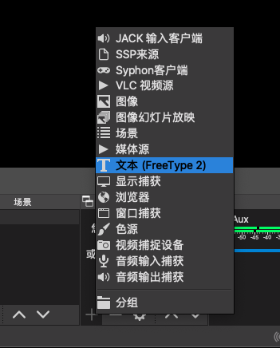
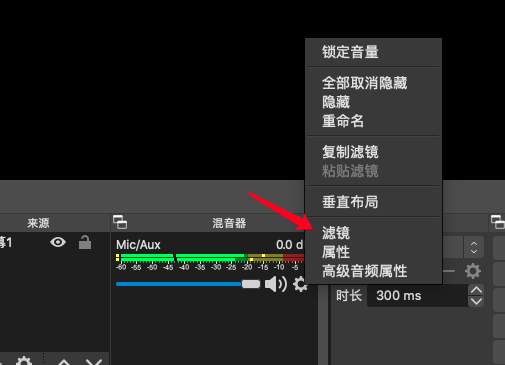
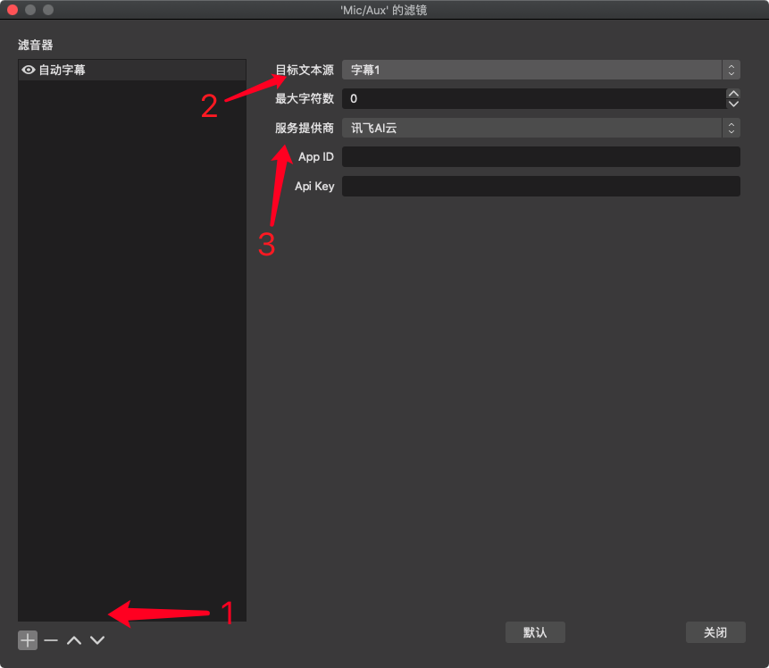
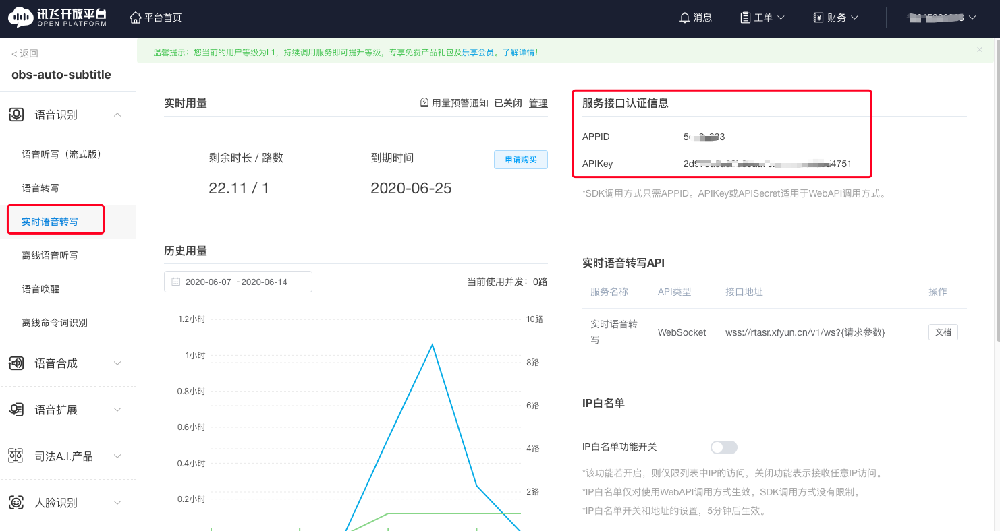
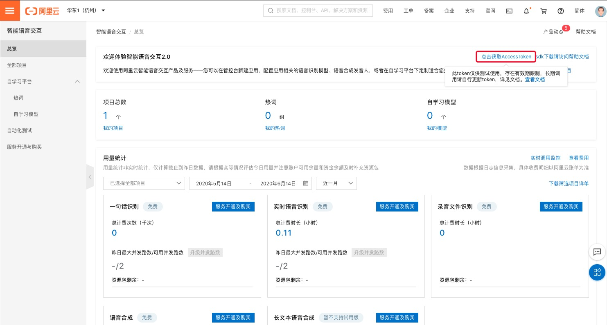
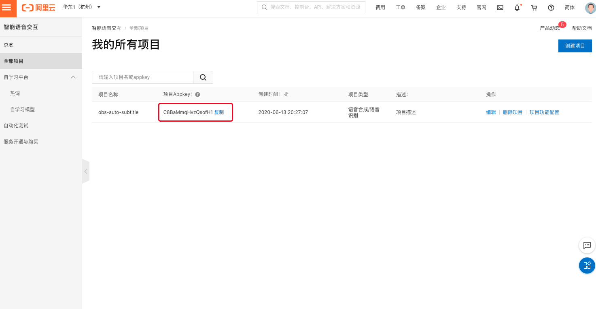

# obs-auto-subtitle
OBS自动字幕插件，一边讲话一边自动生成字幕！

目前仅支持普通话

[English](./README.md)

## Feature
- **自动字幕过滤器** : 转码音频并发送到云平台。
- **阿里云 NLS**: 支持使用阿里云 NLS 服务进行字幕生成。
- **讯飞AI云 RTASR**: 支持使用讯飞 AI 云 RTASR 服务进行字幕生成。
- **华为云 RASR**: 支持使用华为云 RASR 服务进行字幕生成。

## Downloads
Windows/macOS 系统的安装包可以从 [Releases](https://github.com/summershrimp/obs-auto-subtitle/releases) 页面下载。

## 使用说明
### 创建文字源
创建 **文本（GDI+/Freetype2）** 文字源 ~~**文本（Freetype2）** 文字源（Windows版OBS在过时源中）~~，并调整相关设置。推荐设置最大宽度为画布宽度 （仅freetype），推荐修改源名称。

### 创建自动字幕滤镜
选择您想用于生成字幕的音频源，并添加滤镜

添加自动字幕滤镜，并设置文字源为上一步创建的文字源。

选择您想使用的语音识别服务提供商。

### 讯飞云参数
登陆讯飞云，并完成身份验证和购买，应购买**实时语音转写**服务。随后在控制台页面找到**实时语音转写**服务的`AppId`和`ApiKey`，并填写到插件对应选项中。
https://console.xfyun.cn/services/rta

### 阿里云参数
登陆阿里云，完成身份验证和服务开通，应购买**智能语音交互**服务。随后在控制台页面新建项目，并生成Token。Token有效期较短，一般为一天，请每次使用是重新生成。
https://nls-portal.console.aliyun.com/overview

## 交流群

Telegram: https://t.me/joinchat/BbK1thHn4aNXH319h61Spw

QQ:

## 自动化构建

